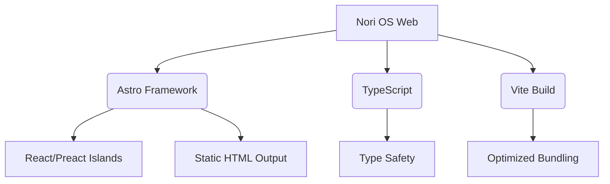

<div align="center">


# Nori OS Web

[](LICENSE)
[](https://astro.build)
[]()
[](CONTRIBUTING.md)

> 🌐 基于 Astro 构建的现代化 Web 操作系统界面体验
> 🚀 零 JavaScript 运行时默认加载 · 岛屿架构 · 极致性能

[English Version](README_EN.md) · [贡献指南](CONTRIBUTING_CN.md)

</div>

---

## ✨ 特性亮点

<div align="center">

| 🎨 **原生体验** | ⚡ **极速加载** | 🔒 **安全隐私** | 📱 **响应式** |
| :---: | :---: | :---: | :---: |
| 类桌面交互逻辑 | 毫秒级首屏渲染 | 本地化数据处理 | 全设备自适应 |

</div>

- **🏝️ 岛屿架构 (Islands Architecture)**: 仅在需要时加载交互组件，默认发送零 JavaScript。
- **🛠️ 模块化应用系统**: 包含浏览器、文件管理、终端、邮件等完整应用生态。
- **🎭 动态主题支持**: 内置多套视觉主题，支持实时切换与个性化定制。
- **♿ 无障碍访问**: 遵循 WCAG 2.1 标准，确保所有用户均可流畅使用。

---

## 🖥️ 应用概览

本项目包含多个独立运行的 Web 应用模块：

<div align="center">


</div>

| 应用名称 | 描述 | 状态 |
| :--- | :--- | :---: |
| **Browser** | 沉浸式网页浏览体验 | ✅ 稳定 |
| **Files** | 可视化文件管理系统 | ✅ 稳定 |
| **Terminal** | 全功能 Web 命令行终端 | ✅ 稳定 |
| **Mail** | 极简主义邮件客户端 | ✅ 稳定 |
| **Messenger** | 实时通讯工具 | ✅ 稳定 |
| **Preview** | 多媒体文件快速预览 | ✅ 稳定 |
| **Login** | 安全身份认证入口 | ✅ 稳定 |
| **Dock** |  macOS 风格启动栏 | ✅ 稳定 |

---

## 🛠️ 技术栈



- **核心框架**: [Astro](https://astro.build) - 内容优先的 Web 框架
- **语言**: TypeScript / JavaScript (ESNext)
- **样式**: CSS3 / SCSS (模块化)
- **构建工具**: Vite
- **包管理**: npm / pnpm

---

## 🚀 快速开始

### 前置要求

- Node.js >= 18.0.0
- npm >= 9.0.0 或 pnpm >= 8.0.0

### 安装依赖

```bash
npm install
# 或
pnpm install
```

### 开发模式

启动本地开发服务器（热重载）：

```bash
npm run dev
```

> 访问 `http://localhost:4322` 查看效果

### 生产构建

构建优化的静态资源：

```bash
npm run build
```

构建产物将输出至 `dist/` 目录。

### 预览构建

在本地预览生产构建结果：

```bash
npm run preview
```

---

## 📂 项目结构

```
src/
├── APPS/               # 应用模块集合
│   ├── browser/        # 浏览器应用
│   ├── files/          # 文件管理器
│   ├── terminal/       # 终端模拟器
│   └── ...             # 其他应用
├── components/         # 全局通用组件
├── layouts/            # 页面布局模板
├── pages/              # 路由页面
│   └── index.astro     # 主入口
├── styles/             # 全局样式
└── utils/              # 工具函数库
docs/                   # 技术文档
public/                 # 静态资源
```

---

## 📄 许可证

本项目采用 **GPL-3.0** 开源许可证。
详见 [LICENSE](LICENSE) 文件。

---

## 🤝 参与贡献

我们欢迎各种形式的贡献！无论是修复 Bug、新增功能还是改进文档。

请查阅我们的 [贡献指南 (中文)](CONTRIBUTING_CN.md) 或 [Contributing Guidelines (EN)](CONTRIBUTING.md) 了解如何开始。

### 贡献流程

1. Fork 本项目
2. 创建功能分支 (`git checkout -b feature/amazing-feature`)
3. 提交更改 (`git commit -m 'Add some amazing feature'`)
4. 推送到分支 (`git push origin feature/amazing-feature`)
5. 开启 Pull Request

---

## 🔗 相关链接

- [Astro 官方文档](https://docs.astro.build)
- [岛屿架构介绍](https://jasonformat.com/islands-architecture/)
- [Live2D Cubism](https://www.live2d.com/en/)

---

<div align="center">


**Nori OS Web Team** © 2024

[返回顶部](#nori-os-web)

</div>
